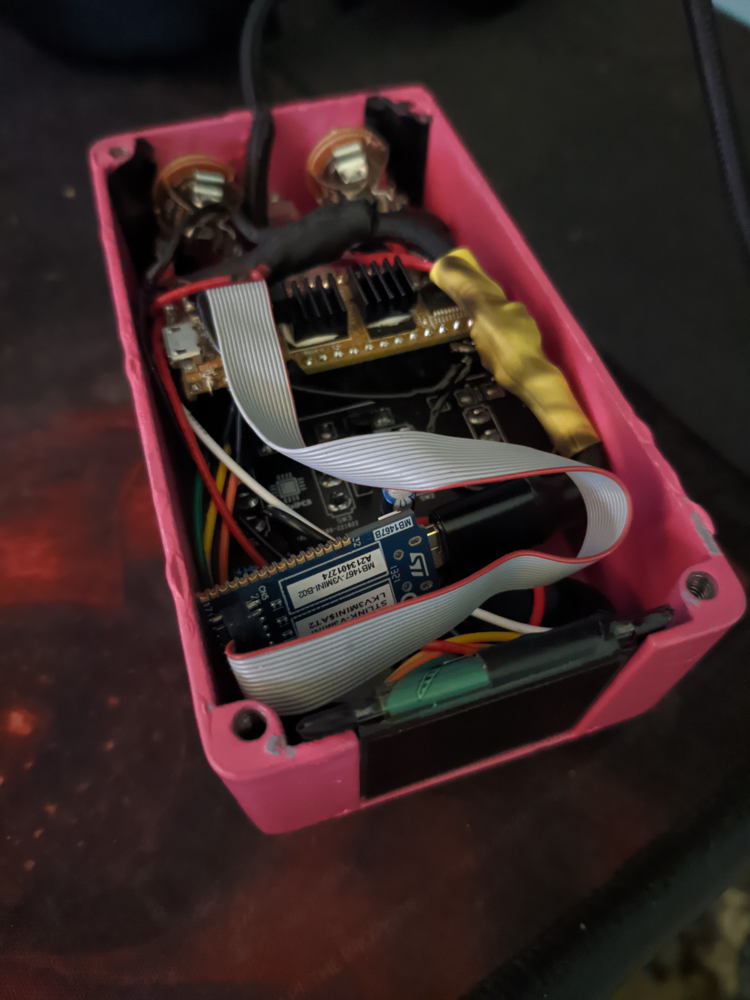
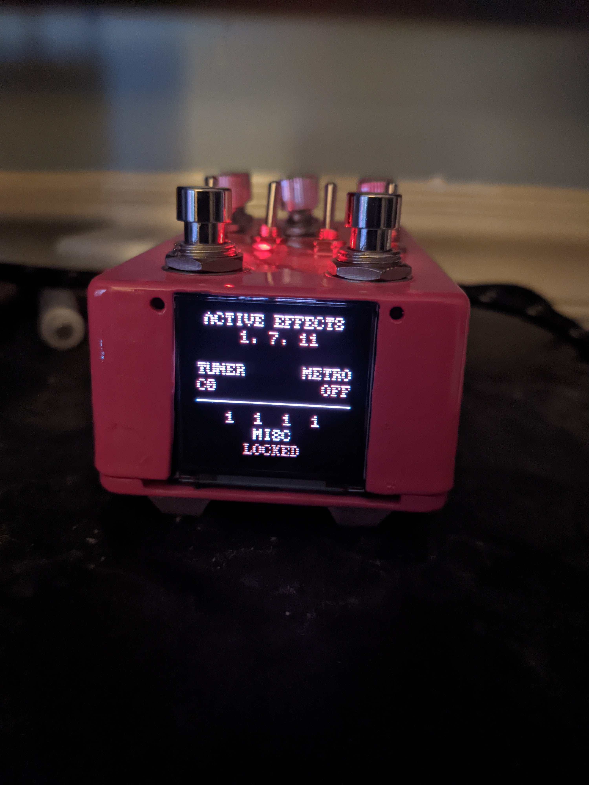

# Ironpedal <a href="https://www.pcbway.com/"></a>
Guitar pedal firmware for Daisy Seed+Terrarrium boards. This project is sponsored by <a href="https://www.pcbway.com/">PCBWay</a> which is a great place to create custom circuit boards or you can choose from one of the many featured designs that people create and share. They make it very easy to bring your ideas into reality, highly recommended!

## Features
- Small hardware accelerated OLED display that can be toggled off to reduce EMI when not in use
- 16 different effects
- Save/load your effect settings to external flash via QSPI
- Effects can be individually enabled/locked
- Record and play back up to 5 minutes of audio via the Looper effect
- 99 different profiles that you can use to save your settings (number can be increased)
- Moog Ladder input filter for tone control
- 12 selectable screen colors to match the color of your pedal

## Building from source
Make sure you have the [Arm GNU Toolchain](https://developer.arm.com/tools-and-software/open-source-software/developer-tools/gnu-toolchain/downloads) and [OpenOCD](https://github.com/openocd-org/openocd/releases) installed, as well as `make`. To build, run the following command in the main directory.

`make clean && make -j && make program`

## Customizing
Text colors can be changed on the Misc effects screen and the number of profiles supported can be changed in [src/config.h](src/config.h), this will require rebuilding from source.

## Supported effects
| Effect     | Switch position | Knob 1     | Knob 2    | Knob 3    | Knob 4    | Knob 5    | Knob 6     |
| ---------- | --------------- | ---------- | --------- | --------- | --------- | --------- | ---------- |
| Master     | 0000            |            |           | Profile   | LPF       | Resonance | Volume     |
| Overdrive  | 0001            | Blend      |           | Mode      |           | Drive     |            |
| Chorus     | 0010            | Delay      |           | Rate      | Feedback  |           | Depth      |
| Compressor | 0011            | Threshold  |           | Ratio     | Attack    |           | Release    |
| Reverb     | 0100            |            | Feedback  |           |           | LPF       |            |
| Resonator  | 0101            | Decay      |           | Frequency | Stiffness |           | Brightness |
| Autowah    | 0110            |            | Blend     |           | Wah       |           |            |
| Tremolo    | 0111            | Depth      |           | Frequency |           | Shape     |            |
| Looper     | 1000            |            | Mode      |           |           | Volume    |            |
| Decimator  | 1001            | Downsample |           | Mode      |           | Crush     |            |
| Phaser     | 1010            | Frequency  |           | Rate      | Feedback  |           | Depth      |
| Delay      | 1011            |            | Delay     |           |           |           |            |
| Flanger    | 1100            | Delay      |           | Rate      | Feedback  |           | Depth      |
| Pitch      | 1101            |            | Semitones |           | Rate      |           | Flutter    |
| Harmonizer | 1110            | Semitones  | Rate      | Flutter   | Semitones | Rate      | Flutter    |
| Misc       | 1111            |            |           |           |           | Color     | Metronome  |

## Effect chain order
| 1                   | 2          | 3         | 4         | 5      | 6                        | 7      |
| ------------------- | ---------- | --------- | --------- | ------ | ------------------------ | ------ |
| Pitch               | Autowah    | Overdrive | Chorus    | Delay  | Misc: Metronome          | Looper |
| Misc: Tuner         | Decimator  | Resonator | Tremolo   | Reverb | Master: Volume           |        |
| Harmonizer          | Compressor |           | Phaser    |        |                          |        |
| Master: Moog Filter |            |           | Flanger   |        |                          |        |

## Usage
| Operation                               | Instructions                                                       |
| --------------------------------------- | ------------------------------------------------------------------ |
| Turn the OLED display on/off            | Single tap both foot switches                                      |
| Change the current effect screen        | Move the toggle switches into their correct position               |
| Enabling & disabling the current effect | Single tap the left foot switch (has no effect on Master and Misc) |
| Locking & unlocking the current effect  | Single tap the right foot switch                                   |
| Load saved effect settings              | Hold the left foot switch for 3 seconds                            |
| Save effect settings                    | Hold the right foot switch for 3 seconds                           |

## My settings, feel free to use these as a starting point
| Effect     | Switch position | Knob 1    | Knob 2   | Knob 3       | Knob 4    | Knob 5        | Knob 6 |
| ---------- | --------------- | --------- | -------- | ------------ | --------- | ------------- | ------ |
| Master     | 0000            |           |          | 1            | 4.5 kHz   | 45            | 150    |
| Overdrive  | 0001            | 45        |          | Hard         |           | 45            |        |
| Chorus     | 0010            | 75        |          | 0.30         | 20        |               | 90     |
| Compressor | 0011            | -12 dB    |          | 2:1          | 0.118     |               | 0.118  |
| Reverb     | 0100            |           | 25       |              |           | 4.5 kHz       |        |
| Resonator  | 0101            | 20        |          | 78 Hz (Eb2)  | 25        |               | 35     |
| Autowah    | 0110            |           | 50       |              | 10        |               |        |
| Tremolo    | 0111            | 50        |          | 622 Hz (Eb5) |           | Triangle Wave |        |
| Looper     | 1000            |           | Playback |              |           | 100           |        |
| Decimator  | 1001            | 35        |          | Soft         |           | 50            |        |
| Phaser     | 1010            | 1.2 kHz   |          | 0.30         | 20        |               | 90     |
| Delay      | 1011            |           | 0 MS     |              |           |               |        |
| Flanger    | 1100            | 75        |          | 0.30         | 20        |               | 90     |
| Pitch      | 1101            |           | 0        |              | 10 or 50  |               | 10     |
| Harmonizer | 1110            | +12       | 10       | 10           | -12       | 95            | 10     |
| Misc       | 1111            |           |          |              |           | 1             | Off    |

You may find this [chart](http://www.simonpaul.com/wp-content/uploads/downloads/2010/04/Notes-To-Frequencies.pdf) useful when setting certain effect frequencies.

## Keeping noise low
Digital noise is a part of digital pedals and Ironpedal is no different. In order to keep noise levels low, I recommend keeping the screen off when not in use if you decided to add one. These Chinese displays have pulsing voltage converters in them that produce a lot of noise when running and when they are refreshed.

I also recommend using an isolation transformer on the output jack and running separate ground wires wherever you can back to the power supply. The Terrarium is not the most efficient PCB and there are ground loops so we want to try to minimize those effects where possible.

Run the pedal from a dedicated power bank and not your computer as a lot of noise travels down the USB cable as well. If you opted to order a STLINK-V3MINI, I recommend adding another switch to be able to turn it off when not in use.

## Build tutorial

### Preparation
1. Print off the [schematic](datasheets/Terrarium.pdf) with all scaling options turned off in your printer settings. This will make your life easier later and the last page is a physical template for drilling out the pedal case so this step is required.
2. Order all of the parts listed on page 2 of the [schematic](datasheets/Terrarium.pdf), I used [Tayda Electronics](https://www.taydaelectronics.com) for this.
3. Order a [pedal case](https://www.amazon.com/gp/product/B07VNCDSN7).
4. Order a [600:600 / 1:1 isolation transformer](https://www.amazon.com/gp/product/B073PXK2RX). This gets rid of digital noise on the output at the cost of some minor loss (a few dB when measured) on the low end frequencies. Noise is very noticable without one of these.
5. Order a [Terrarium](https://www.pedalpcb.com/product/pcb351) board from PedalPCB.
6. Order a [Daisy Seed](https://www.electro-smith.com/daisy/daisy) module from Electro-Smith with the headers attached, this is the heart of the pedal.
7. (Optional) If you want a screen, order a [1.5 inch 128x128 SSD1351 OLED display](https://www.amazon.com/1-5inch-Interface-Raspberry-Examples-Provided/dp/B07D9NVJPZ).
8. (Optional) If you want a very easy way of updating the firmware without having to open up the pedal every time to push the Seed BOOT/RESET combo, consider ordering a [STLINK-V3MINI](https://www.electro-smith.com/daisy/stlink-v3mini). Definitely worth it in my opinion to save your sanity.

### Drilling out the pedal case
1. Cut out the pedal case template from the last page of the [schematic](datasheets/Terrarium.pdf) and tape it in place. I used painter's tape for this but masking tape is also a good choice.


2. Use a drill press if you have one but if not, hold the pedal case in a vise and try and keep your drill as straight as possible. Use a scrap piece of wood on the underside to keep your holes clean.
3. You can use a digital caliper on each part that will be fitted through a hole to figure out the drill bit sizes to use. Going a little bigger is a good idea for fitting purposes later as things will not line up absolutely perfectly due to manufacturer defects and also just human error.
4. (Optional) File out a rectangle on the front face of the case for the screen. You want to do this by hand and check your work a lot, it's very easy to remove too much material here.


### Soldering the Terrarium board components
1. Gather and organize all your parts.


2. Prepare the Terrarium board by first cleaning the entire surface with alcohol and a soft lint-free cloth. A nice pair of helping hands will stabilize the board when soldering as well, I highly recommend using one.


3. Solder each component of the board according to the [schematic](datasheets/Terrarium.pdf). Go slow and take your time, try and get a nice fit for each component.
4. When you get to the knobs, switches, and LEDs, I recommend tightening everything down in the case and laying the Terrarium board on top of the leads before you solder everything so you get a nice, flush fit.


5. You will need to splice together a single USB cable to power the STLINK-V3MINI and the Daisy Seed if you opted to order one. I also added another switch for the STLINK-V3MINI to further reduce noise when not in use.

6. (Optional) If you opted to use the OLED display, you should solder each pin to the Daisy Seed according to the following table. Pin layout for the Daisy Seed can be found in the datasheet [here](datasheets/Daisy_Seed_datasheet_v1.0.4.pdf). (Credit: [sballano](https://github.com/sballano))

| Screen pin   | Daisy signal | Pin number |
|--------------|--------------|------------|
| Vcc          | 3V3 dig      |         38 |
| GND          | DGND         |         40 |
| DIN          | MOSI/D6      |          7 |
| CLK          | SCLK/D2      |          3 |
| CS           | CS/D3        |          4 |
| DC           | MISO/D1      |          2 |
| RST          | D30          |         37 |

### (Optional) Paint the pedal case
1. This step is optional but feel free to paint your pedal case, I went with a punk pink color. You will want to use primer as paint falls off aluminum pretty easily without something to stick to.


### Flashing the firmware
1. Erase the QSPI external flash block using [STM32Cube](https://www.st.com/en/ecosystems/stm32cube.html) or something similar, it's needed initially for saving/loading your settings.
2. Download the latest [Ironpedal firmware](https://github.com/snail23/ironpedal/releases/latest).
3. On your PC, copy `ironpedal.bin` to the external drive provided by the Daisy Seed which will flash it and automatically reboot.
4. Congratulations, you're done!

The inside of your pedal should look similar to this. It's very crowded!







## Reporting bugs
If you encounter a bug and wish to report it or have feature suggestions and other topics, please [open an issue](https://github.com/snail23/ironpedal/issues).

## License
```
MIT License

Copyright (c) 2023 Snail

Permission is hereby granted, free of charge, to any person obtaining a copy
of this software and associated documentation files (the "Software"), to deal
in the Software without restriction, including without limitation the rights
to use, copy, modify, merge, publish, distribute, sublicense, and/or sell
copies of the Software, and to permit persons to whom the Software is
furnished to do so, subject to the following conditions:

The above copyright notice and this permission notice shall be included in all
copies or substantial portions of the Software.

THE SOFTWARE IS PROVIDED "AS IS", WITHOUT WARRANTY OF ANY KIND, EXPRESS OR
IMPLIED, INCLUDING BUT NOT LIMITED TO THE WARRANTIES OF MERCHANTABILITY,
FITNESS FOR A PARTICULAR PURPOSE AND NONINFRINGEMENT. IN NO EVENT SHALL THE
AUTHORS OR COPYRIGHT HOLDERS BE LIABLE FOR ANY CLAIM, DAMAGES OR OTHER
LIABILITY, WHETHER IN AN ACTION OF CONTRACT, TORT OR OTHERWISE, ARISING FROM,
OUT OF OR IN CONNECTION WITH THE SOFTWARE OR THE USE OR OTHER DEALINGS IN THE
SOFTWARE.
```
